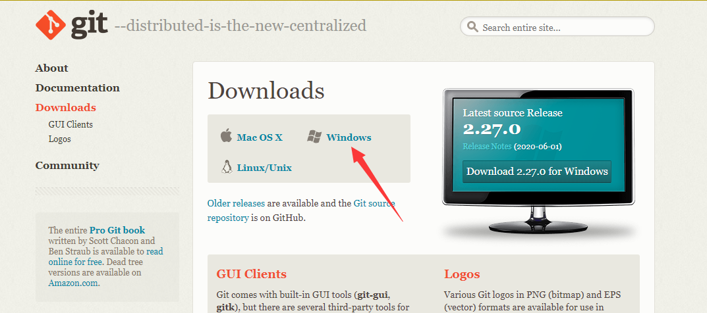
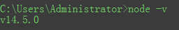

## 一、初始环境配置

**1.1.注册一个Github账户** https://github.com/

**1.2.下载并安装Git** https://git-scm.com/downloads

下载安装除了配置安装路径 其他都点下一步

**1.3.**<u>(非必须)</u> **下载并安装TortoiesGit**(*这个主要是配合Git来使用，如果单纯用Git提交代码也是可以的，只不过需要手动去敲命令行更新提交代码会有些麻烦，安装TortoiesGit后会方便很多*) https://tortoisegit.org/download/

**1.4.下载node.js**(Vue需要使用) https://nodejs.org/en/download/

下一步直到安装完成，安装完成后，打开命令提示符（cmd）

输入：node -v    出现相应版本证明安装成功

node环境已经安装完成，由于有些npm有些资源被屏蔽或者是国外资源的原因，经常会导致用npm安装依赖包的时候失败，所有还需要npm的国内镜像---cnpm

在命令行中输入：npm install -g cnpm –registry=https://registry.npm.taobao.org回车，大约需要3分钟

如果报错或没反应，则卸掉node.js重新安装

出现上图说明安装成功

